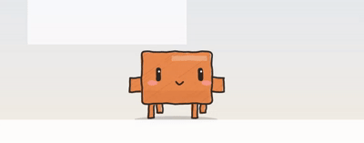

# ClawdPet 🦀

[](LICENSE)

<p align="center">
  
</p>

把 [clawd.js](clawd.js) 那只蜡笔小螃蟹做成真正的桌面宠物：透明置顶浮在桌面上，会自己散步、被拖着会晃腿、丢下去会弹一下、久坐会睡着冒 z、鼠标靠近会醒。

**clawd.js 一行未改。** 原文件是某个 canvas 工程拆出来的角色模块，它依赖的 20 多个全局函数（`PAL` / `MX` / `sh` / `ink` / `hand` / `beatInfo` …）原工程没跟过来，所以这个仓库做了两件事：

1. 按调用点把这套**蜡笔涂鸦渲染引擎**反推补齐（[src/engine.js](src/engine.js)）；
2. 给它加一层**桌宠行为**（散步 / 物理 / 交互 / 气泡），再用 Electron 套上透明窗口。

## 跑起来

```bash
npm install          # electron 31.7.7 + koffi（读前台窗口用）
npm start            # 启动桌宠（小透明窗口跟在桌宠后面浮在桌面上）
npm run web          # 只开网页调试台（不装 Electron 也能调画面）
npm run dist         # 打包 → 换图标 → 自签名，一条龙
npm run sign         # 只重签 dist 里的 exe（加 --no-trust 不动信任库）
npm run icon         # 把根目录的 图标.png 转成托盘/打包图标（build/icon.ico + icon.png）
```

调试入口：

- `http://127.0.0.1:5173/dev/index.html?mode=sheet` —— 表情矩阵调试图（9 眼型 × 嘴型 / 7 帽子 / 走路帧 / 尺寸 / 气泡），改 [src/engine.js](src/engine.js) 刷新即可。
- `http://127.0.0.1:5173/dev/index.html?mode=scene` —— 假桌面场景，跑的是**真实的桌宠状态机**，可以直接拖拽试手感。快捷键：`W` 散步 · `D` 跳舞 · `H` 换帽子 · `N` 名牌 · `L` 切中英文 · `P` 假装探头 · `G` 假装你回来了 · `空格` 说话。网页版读不到真窗口，所以 `P` 是拿假窗口调的。

`npm start -- --selftest` 会拉起窗口跑 2.5 秒，把渲染进程里的真实状态打到 stdout、把桌宠窗口的画布存成 `build/pet-snapshot.png`，然后退出——改完代码想快速验证时很好用。

## 窗口是怎么做的（为什么不会挡到桌面）

桌宠窗口不是铺满屏幕的透明层，而是 **560×480 的小窗口，跟着桌宠在屏幕上平移**：桌宠走到窗口边缘，窗口就推着它继续走，走到屏幕边缘它才转身。桌宠在 `world`（显示器工作区）坐标里活动，绘制在 `box`（画布）坐标里，两套坐标由 `cam` 互转。

这么做的原因：铺满屏的透明置顶层在 Windows 上会把整个桌面吃掉（点不动任何东西、新窗口也被压住），而且哪怕只有一瞬间穿透失效，受影响的也是整块屏幕。小窗口最坏情况只挡 560×480。

平时窗口是鼠标穿透的，鼠标碰到桌宠才临时可点可拖；桌宠自己走开而鼠标没动时，靠每帧的命中检测把穿透恢复回去（Chromium 不会因为"内容移开了"补发 mousemove）。Win+D（显示桌面）会把窗口最小化，这里监听了 `minimize`/`hide` 并把它拉回来。

窗口移动和绘制用的是**同一个** `cam` 值：先把 `cam` 乐观地改掉再去要窗口移动，等 IPC 回来只在校正被系统夹住的情况。早期版本等 IPC 回来才改 `cam`，每帧差 1~2px，桌宠走起来看着就是抖的。实测帧时间 16.7ms（60fps），绘制不是瓶颈。

## 多显示器

主进程每 350ms 读一次鼠标位置（透明穿窗收不到全局鼠标事件），鼠标在哪块屏，桌宠就追到哪块：

- 横向相邻的屏会自动合并成一段连续区域，桌宠直接走过去，不会卡在屏幕接缝；
- 两块屏高度不一样时，走过去会从高处掉下来（有重力）；
- 中间有间隔的屏（不常见）会在屏边翻过去；
- 拔插显示器 / 改分辨率时窗口会重新夹回工作区内。

## 玩法

| 操作 | 反应 |
| --- | --- |
| 什么都不做 | 自己散步、撞屏幕边缘转身、久坐睡觉冒 z |
| 鼠标靠近 | 眼神跟着你走；它睡着会被你靠近吵醒 |
| 左键拖拽 | 拎起来四条腿乱晃，甩出去有抛掷惯性 |
| 单击（没拖动） | 摸头：爱心眼 + 脸红 + 冒一句傻话 |
| 鼠标在别的屏上 | 它自己走过去（相邻屏无缝穿过去） |
| 你切到别的窗口 | 它走到那个窗口边上、顺着侧边爬上去，在标题栏上探头张望，说一句「在看什么呢」然后自己下来 |
| 你锁屏离开又回来 | 蹦两下跟你打招呼；走得越久说的越激动（超过 5 分钟会变成「哇——好久不见！」） |
| 双击 | 开聊天窗（聊天功能没开的话它会告诉你去哪儿开） |
| 右键 | 换帽子 / 换颜色 / 改大小 / 逐个开关行为 / **中英文切换** / 设置 / 退出 |
| 右键 → 名牌文字… | 开一个小输入窗改名字（Electron 不支持 `window.prompt`，以前这一项点了是没反应的） |
| 托盘图标 | 显示隐藏、设置、调试表情表、退出 |

行为开关全部独立（散步、拖拽、重力、眼神、待机、气泡、跳舞、**显示名牌**、切窗口探头、回来打招呼），右键菜单里勾，或在设置窗里改。

### 关于「开启聊天」那个开关

菜单里的 **「聊两句…」** 和设置里的 **「启用对话功能」** 是两件事：

- 「聊两句…」只是一个动作，点了就开聊天窗，文案永远不变；
- 「启用对话功能」是总开关，关掉之后双击和「聊两句…」都不会弹窗，它只会用气泡告诉你「还没开聊天功能，右键里勾上就行」。

（以前这两者被绑在一起，开了开关菜单项就变成「结束聊天」，所以看着很莫名其妙。现在解耦了。）

名牌的**文字**和**显不显示**也是分开的：设置里改文字，勾「显示名牌」决定画不画。

## 说话（API 随便填，不限官方）

右键「聊两句…」或双击桌宠会开一个小聊天窗，回复显示在桌宠的蜡笔气泡里。设置窗里可以填：

- **格式**：`自动探测`（先打 `/v1/messages`，不通再换 `/v1/chat/completions`）/ 指定 Anthropic / 指定 OpenAI
- **接口地址**：可以只写到 `https://xxx.com`、`https://xxx.com/v1`，也可以直接粘完整的 `/v1/messages` 或 `/v1/chat/completions`，官方或中转都行
- **模型名**：任意 id，按你那边实际支持的填
- **API Key**：用 Electron `safeStorage` 走系统钥匙串加密后存在 `userData/settings.json`，不进渲染进程明文
- **人设 / 温度**：可改

请求在主进程发（渲染进程碰不到 Key，也绕开 CORS），SSE 逐 token 推进气泡。等第一个字回来之前，气泡里是三个依次跳起来的小圆点，不是空长条。「测试连接」按钮会告诉你实际命中的是哪种格式。

## 中英文切换

界面全中英两套，右键菜单 → **语言 / Language**、托盘菜单、以及设置窗「长什么样」里的语言下拉框，三个入口都切同一份设置（`Settings.lang`，默认 `zh`）。

文案表在 [src/i18n.js](src/i18n.js)，一份表两处用：

- **渲染进程**（桌宠页 / 设置窗 / 聊天窗 / 名牌窗）当经典脚本加载，顶层 `I18N` 直接用；
- **主进程** `require('../src/i18n.js')` 拿同一份 —— 托盘菜单、窗口标题、原生确认框、对话报错全在主进程，那边没有 DOM，两边各写一份迟早漏翻。

查 key 的顺序是「当前语言 → 中文 → 原样吐出 key」，所以漏翻的顶多露出 key 名，不会出现空字符串。

切换的动作链：

```
某个入口改 lang → Settings.save({lang}) → 主进程 settings:save 发现语言变了
  → I18N.setLang() → 重建托盘菜单（setContextMenu 立即替换）→ 改三个小窗的标题
  → 向所有窗口广播 lang:changed → 各窗 I18N.applyI18n(document) 刷 data-i18n / data-i18n-ph / <html lang>
```

几个容易踩的点：

- **`data-i18n` 不能标在含 `<input>` 的 `<label>` 上** —— `textContent` 会把 input 一起抹掉。设置窗里每个勾选行的文字都单独包了一层 `<span>`。
- **`lang:changed` 广播不跟着 `settings:changed` 走**（托盘菜单改语言时只发广播）。桌宠窗口的 `onLang` 里必须先 `Settings.data.lang = l` 再 `applyLang()`，否则它会拿旧值又刷回去。
- **默认人设跟着语言走，但只在该值「还是某一版默认值」时才换**（`Settings.syncPrompt()`）。自己改过的人设永远不会被切语言冲掉。
- 桌宠的台词是画在画布上的，`I18N.lines()` 现取现用，所以切完下一句话就变了，不用重绘。

自检里有两行盯着这件事：

```
"i18n":{"zhMenu":"自主散步","enMenu":"Wander on its own","zhLines":10,"enLines":10,
         "differs":true,"complete":true,"enSpec":"Wander on its own","enBubble":"Still clocking in",
         "zhSpec":"自主散步","restored":true,"saved":"en","persisted":"zh","ok":true}
UI {"zh":{"save":"保存","hat":"派对帽","html":"zh-CN","winTitle":"ClawdPet 设置"},
    "en":{"save":"Save","hat":"Party hat","html":"en","winTitle":"ClawdPet Settings"},
    "back":{...},"switched":true,"sameLang":true,"titlesDiffer":true,"ok":true}
```

`i18n` 那行验表本身（两种语言都取得到非空文案、`menuSpec()` 跟着换、存盘→主进程→读回整一圈通）；`UI` 那行真的把设置窗开起来、改下拉框、点保存，看 DOM 文案和窗口标题是不是一起变了，再切回来确认没卡在英文。

## 探头张望 & 空闲检测是怎么接的

主进程每秒采一次样，用 IPC 推给渲染进程：

- **前台窗口标题 + 矩形**：`koffi` 直接调 Win32（`GetForegroundWindow` / `GetWindowTextW` / `GetWindowRect` / `IsIconic`）。koffi 是纯 JS 的 FFI 库，**不需要管理员、不需要编译工具链**，装上就能用；`asarUnpack` 里已经把它的 `.node` 解出来了。设置窗底部有一行实时检测结果，装不上或读不到会明说。
- **锁屏 / 空闲**：Electron 自带的 `powerMonitor`（`lock-screen` / `unlock-screen` 事件 + `getSystemIdleTime()`）。

自己那几个窗口（桌宠 / 设置 / 聊天 / 调试）的原生句柄会被排除掉，不然它会兴冲冲爬到自己开的聊天窗上。渲染进程拿到标题变化后走一条完整的往返链：

```
chase/wall → climb/wall → chase/top → peek/top → chase/down → climb/down → idle
走到墙根     顺墙往上爬    沿标题栏走到中间  探头张望 5~9s  沿标题栏走回墙根  顺墙爬下来    回地面
```

**看完了是原路返回，不是直接掉下去。** 一开始 `peek` 结束后直接 `enter('fall')`，从标题栏自由落体回任务栏（0.7 秒左右、单帧十几像素），随手窗也跟着飞快往下扫 —— 看起来就是“看了一下突然闪现弹回任务栏”。现在会先沿标题栏走回那面墙、再顺着爬下来，单帧纵向位移最多 4px。

自检里直接盯这个：

```
"peek":{"seq":"chase/wall>climb/wall>chase/top>peek/top>chase/down>climb/down>idle",
        "maxJump":"4px@climb/wall","smooth":true,"walkedBackDown":true,
        "endPlat":false,"endY":1392,"floor":1392}
```

`maxJump` 超过 8px 就说明又退化成“直接掉下去”了；`walkedBackDown` 要求轨迹里必须同时出现 `chase/down` 和回程的 `climb`。

任何时候你拎它、或者它要跨屏追鼠标，都会走 `leavePeek(true)` 立刻中止这趟探险（那就直接落地，不演了）。

标题栏那行是用窗口矩形顶部做的「临时平台」（`Pet.plat`），但地板高度另有 `floorY()` 管——两套别混了，不然它会在原地瞬移到窗口顶上。

### 为什么它以前往上爬会把头切掉

窗口的上下留白以前是写死的比例（`bh * 0.26` ≈ 125px），但它的脑袋比这个高得多——实测（带上最高的派对帽，扫画布第一行非透明像素量出来的）：

| 姿势 | 头顶高度 |
| --- | --- |
| 站着 | 1.40 × 体型 |
| 探头拉伸（`squash = -0.11` 把 y 拉长 11%） | 1.55 × 体型 |

150px 的体型就是 232px 的脑袋，比 125px 的留白高一倍，所以往上走的时候头顶就顶出画布被切了。现在 `headroom()` 直接按 `1.55s + 8` 算，体型多大都够。

顺手加了一条约束：如果那个窗口的标题栏贴着屏幕最上沿（**最大化的窗口就是这种情况**），窗口再往上就没地方画了，所以会把「平台」往下挤到 `顶部 + headroom` 那儿。也就是说，对着最大化的窗口它不会真的站在那根标题栏上，而是站在它下边一点——这是屏幕本身的限制，不是 bug。

自检里对 90/120/150/200/260 五个尺寸都拿这个最坏情况跑了一遍，扫画布第一行确认没有像素溢出。

### 一轮自测挖出来的七个 bug

这些都是后来加功能时顺手查出来的，其中 **B1/B8/B4** 三个在修之前是可以把桌面宠物搞成“不可用状态”的。

**B1 · 右键菜单和设置窗的尺寸列表不是同一份**

菜单里是 `100/150/200/260`，设置窗那个下拉框是 `90/120/150/200/260`。于是「右键选 100px → 去设置窗点保存」这一下：下拉框里没这一项，浏览器把 `value` **静默置空** → `Number('') = 0` → 桌宠当场消失。

**B2 · `size` 完全没有校验**

`s = 0` 不只是画不出来：命中检测里要除以 `0`，`dx*dx + dy*dy <= 1` 永远为假，所以**既看不见也点不到**——不能拖、不能右键、不能双击，只能杀进程重开。现在统一到 `SIZE_CHOICES`（src/settings.js）一份，`Settings.sanitize()` 把非法值就近归一（旧菜单选出来的 100px → 90，不丢设置），`Settings.bodySize()` + `Pet.applySettings()` 再兜一层。设置窗的 `fill()` 也会检查“写进去的值 select 认不认”。

**B3 · 英文被按字符拦腰截断**

`handWrap` 以前一律逐字符断行（这只对中文成立）。英文一进来：

```
"Still clocking in tod" / "ay and the deadlin" / "e is tomorrow mor" / "ning"
```

现在 CJK 逐字、拉丁词整块，单个词就超宽（比如长 URL）才再硬断。

**B4 · 长回复的气泡整个掉出画布**

窗口只有 560×480，而摆位逻辑只有两步：“头顶放不下就翻到脚下”。一个 1600 字符的英文回复能擑到 **29 行（h=497）**，头顶起点已经是 −47，翻到脚下是 y=504 —— **整块看不见**。英文一句顶中文两三句，所以加了英文之后特别容易触发。现在 `placeBubble()` 三步走（头顶 → 脚下 → 夹在画布里），并且 `fitLines()` 只显示**最后 7 行**（完整回复在聊天窗里，气泡只管“它在说什么”）。

**B5 · 切了语言但人设其实没换**

人设跟着语言走这件事一开始只在渲染进程做，而真正发请求时读的是**主进程**那份（磁盘上的 `settings.json`）。结果：界面切成英文了，桌宠还是用中文人设回答。现在 `reconcilePrompt()` 放在主进程的 `readSettings`/`writeSettings` 里，两边一致；并且仍然只在「还是默认值」时才换（`promptKeptCustom` 盯的就是这条）。

**B6 · 「唔…」没跟着语言走**

出错时气泡前缀是硬编码的中文。

**B7 · `win:visible` 注册了两个 IPC 处理器**

Electron 不会“后注册的覆盖先注册的”，两个都会跑：同一个开关被处理两次，`userHidden` 也被算了两遍。

**B8 · 气泡包不住字（`measureText` 量不准）**

`hand()` 是**逐字符**画的，每两个字符之间还插了一个 `gap`，每个字符还随机微缩放。而算气泡宽度用的是 `ctx.measureText(整句)` —— 量出来比实际画出来的窄一截：

| 一行 | measureText | 实际画出 | 少算 |
| --- | --- | --- | --- |
| 69 字符英文 | 449px | **500px** | 52px |
| 8 字符中文 | 128px | 134px | 7px |

中文短行只差 7px，所以一直没暴露；英文一行长句直接让字捅出气泡两边。现在加了 `handWidth()`，按 `hand()` 同一套算法量（气泡宽度、名牌宽度、`handWrap` 的断行判定都用它）。

这一轮全部变成了可断言的回归项（`SANITY` 段）：

```
SANITY {"sameList":true,"from100":90,"from0":90,"fromNaN":150,"fromHuge":260,"fromMinus":90,
        "allSane":true,"petS0":90,"petHit0":true,
        "wrapEn":"Still clocking in | today and the | deadline is | tomorrow | morning",
        "wrapWordSafe":true,"wrapCnOk":true,
        "bubble":{"lines":7,"y":171,"h":127,"below":false,"H":480},
        "bubbleInside":true,"linesCapped":true,"bubbleNormal":true,
        "textFits":{"widestLine":457,"boxW":473,"over":-16},"textFitsOk":true,
        "promptFollowsLang":true,"promptKeptCustom":true,"ok":true}
```

`petS0`/`petHit0`：即使把 `Settings.data.size` 直接改成 0，桌宠也还有正常体型而且点得到。`over:-16` 表示气泡比最宽那行还宽 16px（不再穿帮）。

### 为什么右键菜单以前会卡死

桌宠窗口是 `focusable: false` 的（不然会抢你正在用的窗口的焦点）。原生弹出菜单（`Menu.popup`）挂在一个不能激活的窗口上时，菜单能弹出来但**点不动、也关不掉**，主进程的嵌套消息循环就一直转下去：所有 IPC 都被堵住，`win:move` 收不到回复，桌宠就不再跟着窗口走 —— 看起来就是「右键点了就卡成一块石头」。

修法：弹菜单前把窗口临时改成 `setFocusable(true)`，菜单关掉之后（走 `popup` 的 `callback`）再还原。另外菜单开着的时候桌宠会原地站住（`menu:state` 那条 IPC 通知渲染进程），免得窗口跟着它走、把菜单和它错开。菜单项的 `click` 也推到消息循环外面（`setTimeout(..., 0)`）再执行，因为「设置 / 聊天 / 退出」都是在菜单自己还没收起来的时候开新窗口。还有 120 秒的兜底：万一 callback 没回来，就投一个 `WM_CANCELMODE` 把菜单强制收掉并复位状态。

`GUARD` 那行把所有这一类“卡死”都变成可断言的：

```
GUARD {"tapReleased":true,"tapFace":"heart","tapCanMove":true,"orphanDragHealed":true,
       "danceEntered":true,"danceExited":true,"chaseStarted":true,"chaseGaveUp":true,
       "pauseHealed":true,"dragDropped":true}
```

自检里的 `MENU` 那行就是在验这个：连开两轮菜单 → `WM_CANCELMODE` 收掉 → **callback 必须回来**（两轮都是 `closed-ok`），而且结束后 `focusable` 要变回 `false`、`menuOpen` 和 `petPaused` 都要复位。能开第二轮就说明上一轮的状态真复位了。

### 为什么「偶尔还是会卡住」——最脏的一个

这个比较险恶，也是最值得记下来的：**读前台窗口标题本来是会卡住整个主进程的**。

`GetWindowTextW` 对别的进程的窗口，内部走的是跨进程 `SendMessage(WM_GETTEXT)`。而这个调用是**没有超时的** —— 只要对方那个窗口所在的线程正在忙（在跑重活、在做模态循环、已经无响应），这边就会一直等下去。而这是**主进程**，所以它一卡，桌宠窗口跟随、托盘、右键菜单、所有 IPC 全部一起僵住。

这也解释了为什么是「有时」：你切到一个恰好很忙的窗口（浏览器里跑着脚本、IDE 在建索引、游戏在加载），轮到那一刻采样就卡了。

修法：

- 标题改用 `SendMessageTimeoutW` + `SMTO_ABORTIFHUNG`，**硬性 120ms 超时**，拿不到就算了，绝不拖住主进程；
- 先拿 `IsHungAppWindow` 滤一道，已经卡住的窗口直接跳过；
- 矩形改走 `DwmGetWindowAttribute(DWMWA_EXTENDED_FRAME_BOUNDS)` —— DWM 读的是窗口属性，不发跨进程消息，根本不会阻塞；
- 连续几次采样变慢就自动把轮询从 1s 降频（最多到 5s）。

另外加了个**诊断**：事件循环每迟到超过 2 秒就打一条 `[winwatch] 主进程被阻塞了约 Ns`。以后再出这种情况，翻日志一眼就能看出是不是这类原因，不用再猜。

### 聊天窗里那条空白长条

聊天窗等回复时原来先插一个空的 `.ai` 气泡（`add('ai', '')`）。而 `.msg` 是**块级**元素、只限制了 `max-width`，所以一个空气泡会直接占满一整行 —— 看着就是一条空白长条。

修两处：

- `.msg { width: fit-content }` —— 气泡真正变成“内容多宽就多宽”（`.me` 的 `margin-left:auto` 也终于能把用户消息推到右边了）；
- 等回复时改成先插一个 `.thinking` 小气泡，里面是三个依次跳动的点（和桌宠气泡里那套一样）。第一个字一到就把三个点换成真气泡；如果一个字都没回就 `done`/出错，小气泡自己收掉，不会留下空气泡。

自检里的 `CHAT` 那行直接量 DOM：

```
CHAT {"waiting":{"logW":384,"w":65,"cls":"msg ai thinking","dots":3},
      "afterFirst":{"w":68,"cls":"msg ai","text":"你好呀"},
      "afterDone":{"w":124,"text":"你好呀，我在呢"},
      "thinkingIsTiny":true,"hasThreeDots":true}
```

等回复时气泡宽 **65px**而整行是 **384px** —— 以前就是 384。

### 单击摸头会把状态卡死（这个是最好笑的）

现象：在它身上**单击一下**，它就会永远睁着那双大眼睛、再也不走路了。

原因在 `onUp()` 里：

```js
if (d.moved < 7) {
  this.poke();      // 摸头
  return;           // ← 忘了把 state 从 'drag' 里放出来
}
```

`this.drag` 已经置空，但 `state` 还留在 `'drag'`。于是：

- `face()` 永远命中 `case 'drag'` → `eyes: 'wide'`（就是那双大眼睛），`mouth: 'o'` 会被 `draw()` 弄成一段跳动的数值 → 看起来“嘴巴有时是圆的”；
- `update()` 的 `case 'drag'` 把 `vx/vy` 按死，它再也不会走路；
- 拖拽看门狗查的是 `this.drag`（刚被置空）—— 救不回来；
- `'drag'` 状态本来就没有超时，所以是**永久**的。

也就是说，「单击摸头」这个功能一直是坏的：只 happy 两秒（mood 过期），然后永久变成一个被拎着的表情。

修了三层：

1. 摸头之后显式 `enter('idle')`（不在空中就回 idle，否则 `fall` 落地）；
2. 给 `update()` 加了**不变量**：`state === 'drag'` 但没有 `this.drag` 就直接回地面；
3. `onDown()` 在菜单开着（`paused`）时不再把它拎起来。

顺手把同类“能进不能出”的状态一起审了一遍，又抓到两个：

- **踩点跳舞是个死开关** —— `pet.js` 里根本没人调用 `enter('dance')`，只有调试台手动调过，所以勾上它什么都不会发生。现在接上了：勾上当场跳一段，待机时也会偶尔跳；
- **`chase` 可以永远追下去** —— 探头时如果目标被屏幕边界夹得够不到，它会一直原地走。

  不过放弃条件不能简单写成“走了 N 秒就放弃”：目标是屏幕另一头的时候本来就要走二三十秒，一刀切会把正经的赶路也砍掉（自检里 `longChase` 就是盯这个的 —— 实际跑 2341px、1753 帧）。所以改成看**距离有没有在缩短**，连续 2.5 秒没进展才放弃。

### 剩下三道保险

以后再出现“卡住”，这几个不同角度的保险至少有一个会接住：

| 保险 | 防的情况 | 行为 |
| --- | --- | --- |
| `GUARD` 里的暂停自愈 | 菜单关闭的 IPC 丢了 | 暂停超过 20 秒自动解除 |
| `GUARD` 里的拖拽看门狗 | 拎起来后 `mouseup` 没收到（被别的窗口抢了） | 4 秒不动就自己放下（它原来在 `paused` 的 early-return 后面，两个 bug 会叠一起） |
| 窗口移动限流 | 主进程一忙，`win:move` 积一大串过期的 | 同一时刻只放一个在飞，其余只记最新目标 |
| 菜单状态自愈 | 上一次的 callback 没回来 | 下次右键先把旧的 `closePopup` 掉再开新的，右键永远不会“点了没反应” |
| `drag` 不变量 | 任何一条路漏了 `onUp` 的收尾 | `state==='drag'` 却没有 `this.drag` → 直接回地面 |
| `chase` 卡住检测 | 目标被屏幕边界挡住、永远够不到 | 看**距离有没有在缩短**，连续 2.5 秒没进展才放弃 |
| `dance` 超时 | 跳舞开关开着 | 跳 5~10 秒自己停，不会一直跳 |

另：`npm start -- --selftest` / `--sheet` 现在会用**独立的 userData 目录**（`%TEMP%/clawd-pet-selftest`）。一举两得：不会跟你正在跑的桌宠抢单实例锁和 Chromium 缓存（不然自检直接起不来），自检里写设置的测试也不会污染你真实的 `settings.json`。

渲染进程里也不用 `window.confirm`/`alert`/`prompt` 了：Electron 对这几个的实现不可靠，统一走主进程的原生对话框（`ui:confirm`）或专门的小窗口（名牌文字）。

还有一点：菜单关掉时会先 `win.blur()` 再收回「不可聚焦」—— 不然焦点可能留在桌宠身上，你接下来敲键盘像掉进黑洞，观感上也像卡死。

## 许可与出处

本仓库以 **MIT** 许可证发布（见 [LICENSE](LICENSE)）。

`clawd.js` 是原角色模块，来自另一个 Claude 生成的 canvas 工程，**本身没有附带许可证声明**。它由本项目作者取得，并随本仓库一同以 MIT 发布。本仓库对它一行未改。如果你认为它另有出处，请提 issue。完整说明见 [NOTICE](NOTICE)。

除此之外的所有文件——蜡笔渲染引擎（[src/engine.js](src/engine.js)）、桌宠行为层（[src/pet.js](src/pet.js)）、Electron 外壳、打包与签名工具——都是为这个仓库写的。

## 目录

```
clawd.js            原角色模块，一行未改（出处见 NOTICE）
src/engine.js       蜡笔渲染引擎：调色板 / 仿射矩阵 / 几何取点 / 抖动路径光栅器 / 手写字 / 节拍时钟
src/pet.js          桌宠行为：状态机 idle-walk-drag-fall-land-sleep-dance-chase-climb-peek-greet + 物理 + 气泡 + 命中检测
src/i18n.js         中英文文案表：t()/lines()/applyI18n()，渲染进程与主进程共用一份
src/engine.js       里还有 handWidth()：按 hand() 的逐字符排版算法量宽度（measureText 会少算 50px）
src/menu.js         右键菜单规格（网页版渲染 DOM 菜单，桌面版交给主进程做原生菜单）
src/settings.js     配置：网页版 localStorage，桌面版走主进程
src/chat.js         对话：只管把流式增量喂给气泡
app/winwatch.js     桌面观察员：koffi 读前台窗口 + powerMonitor 读锁屏/空闲，每秒推一次
app/name.html/js    名牌文字输入窗（代替 Electron 里不可用的 window.prompt）
app/                Electron 主进程 / preload / 桌宠页 / 设置窗 / 聊天窗
dev/                网页调试台 + 零依赖静态服务器
tools/make-icon.mjs  图标.png → build/icon.ico(7 种尺寸) + build/icon.png(托盘用)，手写 PNG 编解码
tools/patch-exe-icon.mjs  用 electron-builder 自带的 resedit（纯 JS）给 exe 换图标
tools/sign.mjs  自签名（openssl + resedit）
```

## 图标

`npm run icon` 会把根目录的 `图标.png` 转成 `build/icon.ico`（16/24/32/48/64/128/256）和托盘用的 `build/icon.png`。打包时 electron-builder 默认靠 `winCodeSign` 里的 `rcedit.exe` 改 exe 图标，而解包它要建符号链接——没开 Windows 开发者模式就会失败，所以改成用 `resedit` 这个纯 JS 库自己改（`npm run dist` 会在打包后自动执行）。

## 签名

`npm run sign` 做的是**自签名**（openssl 生成证书 + resedit 按 Authenticode 规范签名），并把证书装进**当前用户**的信任库（不需要管理员）：

- 根 CA（`CA:TRUE`）→ `Cert:\CurrentUser\Root`
- 代码签名证书（`CA:FALSE` + `codeSigning` EKU）→ `Cert:\CurrentUser\TrustedPublisher`

签完 `Get-AuthenticodeSignature` 应该是 `Valid`。为什么非做两级不可：一开始想用一张自签证书兼当根和签名者，Windows 直接拒——`A certificate's basic constraint extension has not been observed`，因为 Authenticode 不接受 CA 证书当签名者。

**得说清楚的是**：自签名只能去掉"未知发布者"，去不掉 SmartScreen 那个"Windows 已保护你的电脑"蓝框——那是看文件信誉的，只有商业 CA 签的证书能免。本机编译出来的 exe 一般根本不会触发它。

不想往信任库里装东西就加 `--no-trust`（签名照做，只是 Windows 会显示未知发布者）。已经装上的话，删掉很简单：

```powershell
Get-ChildItem Cert:\CurrentUser\Root | ? Subject -like '*ClawdPet*' | Remove-Item
Get-ChildItem Cert:\CurrentUser\TrustedPublisher | ? Subject -like '*ClawdPet*' | Remove-Item
```

私钥在 `build/key.pem` 和 `build/ca.key.pem`，只在你本机，`.gitignore` 已经挡掉了。

## 已知限制

- 多屏靠主进程轮询鼠标位置（350ms），快速甩鼠标过去会有一点延迟。
- 探头张望靠轮询前台窗口标题（1s），所以 Alt+Tab 之后它最多晚一秒才动。
- 探头张望只能上到窗口的**标题栏那一行**（用窗口矩形顶部算的），不会真的扒住窗口边缘往下爬。
- 对着**最大化的窗口**时，它站在标题栏下方一点而不是正站在那根栏上——因为屏幕上面没地方给窗口了，那样才能保证脑袋不被切掉。
- 右键菜单弹出期间桌宠会站住不动（故意如此，见上一节）；菜单自己不会在鼠标移开时自动消失，那是 Windows 原生菜单的行为。
- 前台窗口如果**已经无响应**（卡住的那个程序），采样会把它当作“不在前台”跳过，探头张望那会儿不会触发。
- 全程没有真正验证过「用真实鼠标去点原生菜单项」这一步（自检是用 `WM_CANCELMODE` 关的），这个得人手确认。
- `dist/win-unpacked/` 里的中间 exe 签了也验不过（段布局被打包器改过，Authenticode 哈希对不上），只签最终 portable 产物。
- 打包 `portable` 需要 electron-builder 下载 nsis 工具链，网络不通时会失败——不影响 `npm start`。
- 切语言只翻界面文案：已经发出去的聊天记录、以及模型自己说的话不会重译。
- 自检/截图在开发时写 `build/`，打包后写在 `userData/`（asar 里的 `build/` 不可写）。
